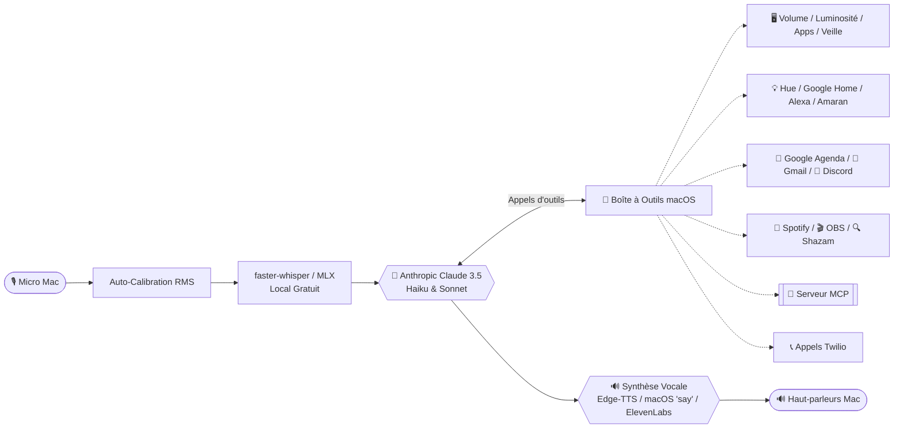

# 🌌 O-R-I-O-N OS (macOS Apple Silicon Edition)

-black)


-teal)

**ORION OS** est un assistant vocal et agentique autonome conçu sur mesure pour **macOS** (optimisé pour **MacBook Air M2 8 Go de RAM**).
Inspiré par le projet Jarvis, il intègre l'ensemble de ses fonctionnalités de A à Z, réarchitecturées pour tirer parti du Neural Engine d'Apple Silicon et du modèle de pointe **Anthropic Claude 3.5**.

---

## ✨ Fonctionnalités Majeures

- 🎙️ **100 % Vocal & Fluide** : Transcription locale gratuite et instantanée avec **Whisper**, mot d'activation ("Hey Orion") et interruption vocale (*Barge-in*).
- 🧠 **Cerveau Claude 3.5 Hybride** : Réflexes ultra-rapides et vision d'écran via `claude-3-5-haiku`, raisonnement profond avec `claude-3-5-sonnet` (avec Prompt Caching pour réduire les coûts).
- 🖥️ **Contrôle Natif macOS** : Volume sonore, luminosité, mise en veille, lancement de n'importe quelle application (`open -a`), raccourcis AppleScript.
- 👁️ **Vision de l'Écran** : « Analyse mon écran », « Explique cette erreur », « Résume cette page » (capture macOS + Claude Vision).
- 💡 **Domotique Complète** : Philips Hue, Google Home / Nest, Amazon Alexa, lumières de tournage Amaran.
- 📅 **Productivité & Bureau** : Google Agenda, Gmail (lecture, brouillons, envoi N3), Apple Notes.
- 🎵 **Média & Shazam** : Contrôle Spotify, reconnaissance de morceaux en direct via Shazamio.
- 🎬 **Créateurs & Vidéastes** : Contrôle OBS Studio (streaming, enregistrement, scènes) et pipeline de production vidéo (idées → script → tournage).
- 📱 **Pont iPhone (Siri)** : Déclenchez Orion à distance depuis vos Raccourcis iPhone et widgets lockscreen.
- 📞 **Téléphonie Twilio** : Appels vocaux automatisés et envoi de SMS.
- 🔐 **Sécurité Graduée (N1 / N2 / N3)** : Confirmation vocale obligatoire pour les opérations sensibles (envoi d'emails, extinction, appels).
- 🔌 **Serveur MCP Standard** : Expose tous les outils d'Orion à Claude Desktop, Cursor et Claude Code.
- 🧭 **Cockpit Web Futuriste** : Interface locale (`http://localhost:8765`) avec télémétrie Mac M2 en direct, suivi budgétaire et contrôle manuel.

---

## 🏗️ Architecture Technique



---

## 🚀 Installation & Démarrage Rapide

### 1. Prérequis
- Un Mac avec macOS 13+ (optimisé Apple Silicon M1/M2/M3/M4).
- [Homebrew](https://brew.sh) installé.
- Une clé API Anthropic ([console.anthropic.com](https://console.anthropic.com)).

### 2. Installation Automatique
```bash
# Cloner le dépôt
git clone https://github.com/votre-compte/O-R-I-O-N-OS-macbook.git
cd O-R-I-O-N-OS-macbook

# Lancer le script d'installation macOS
chmod +x scripts/*.sh
./scripts/install_mac.sh
```

### 3. Configuration
Ouvrez `config.yaml` et renseignez votre clé Anthropic :
```yaml
anthropic:
  cle: "sk-ant-api03-..."
```

### 4. Lancement
```bash
./scripts/start.sh
```

---

## 🧭 Tableau de Bord & Pont iPhone
Une fois lancé, le serveur démarre automatiquement :
- **Cockpit Web** : `http://localhost:8765`
- **Pont iPhone Siri** : Requête POST vers `http://<IP_DU_MAC>:8765/api/commande`

---

## 📄 Licence
Ce projet est distribué sous licence MIT.
